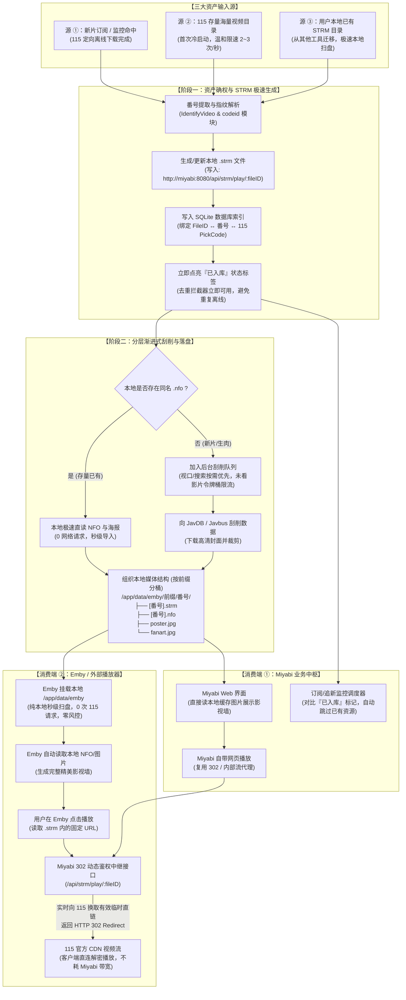

# 本地 STRM 媒体库与 Emby 生态集成全路径技术方案

## 1. 背景与核心设计理念

### 1.1 痛点与背景
- **115 扫盘风控**：115 网盘针对频繁调用 API、递归遍历大目录（List/Stat）有严格的频次限制与风控策略。若使用 Emby、Jellyfin 等媒体服务器直接挂载 115 扫库，或 Miyabi 高频全量扫描网盘，极易导致账号被限流（HTTP 429）或临时冻结。
- **元数据回写损耗**：原有流程将刮削出的 NFO、海报与剧照上传回写至 115，小文件碎片上传不仅耗时、占用配额，且对 115 而言毫无意义（115 原生客户端无法直接识别和渲染 NFO 影视墙）。
- **资产去重与查漏补缺**：许多用户已有本地刮削好的 STRM 文件库，希望能够扫描本地已有资产以同步入库状态，避免重复下载/离线。
- **冷启动存量挑战**：初次使用者 115 网盘内通常已有数千至数万部存量影片，如果处理不当，极易造成扫盘封号或刮削被封 IP。

### 1.2 核心设计原则
1. **云端纯视频底座（115 作为唯一视频存储）**：115 仅保存大体积视频原文件（`.mp4`, `.mkv` 等），作为廉价且海量的数据仓库，**彻底取消元数据向 115 的回写上传**。
2. **本地元数据规范落盘（`/app/data/emby/前缀/番号/`）**：Miyabi 完成离线与刮削后，直接在本地数据目录写出番号文件夹，按前缀分桶组织，内含 `.strm`、`.nfo`、`poster.jpg`、`fanart.jpg`。
3. **零风控极速扫库**：Emby 仅挂载本地 `/app/data/emby` 目录，扫库过程全部为本地磁盘 IO，完全无网络请求，零风控风险。
4. **动态 302 播放中继**：Miyabi 作为 115 账号凭证持有方，为 STRM 提供长效中转入口，并在 Emby 播放时实时换取 115 有效播放直链返回 `HTTP 302`，客户端直连 115 CDN 播放。
5. **轻重分离与渐进式冷启动**：资产确权与元数据刮削解耦。先快速建立索引点亮已入库，元数据分层异步补充（本地 NFO 直读 + 视口按需优先 + 后台平滑限速）。

---

## 2. 完整全路径业务架构图



---

## 3. 技术实施路径细则

### 阶段一：本地 STRM 导出器与目录结构（支持万级目录分桶）

#### 1. 目录结构规范：`/app/data/emby/前缀/番号/`
为避免单目录下平铺数万个文件夹造成的文件管理器假死、SMB 挂载卡顿与扫描瓶颈，采用明确的 Emby 媒体目录与二级前缀分桶：
```text
/app/data/emby/
├── IPX/
│   ├── IPX-123/
│   │   ├── IPX-123.strm     # 纯文本，写入 Miyabi 302 播放地址
│   │   ├── IPX-123.nfo      # 标准影视元数据 (Kodi/Emby 格式)
│   │   ├── poster.jpg       # 高清海报 (800x1200)
│   │   └── fanart.jpg       # 背景剧照
│   └── IPX-124/
├── SSIS/
│   ├── SSIS-456/
│   └── SSIS-457/
└── FC2/
    └── FC2-123456/
```
- **命名直观**：目录名直接命名为 `emby`，用户映射与管理时意图明确；
- **分桶高效**：番号前缀自然分流，每层目录项保持在几百至一千量级，极大减轻文件系统压力；
- **Emby 兼容**：Emby 原生支持多层目录递归识别，分桶后完全不影响影视墙聚合展示。

#### 2. STRM 文件内容定义
STRM 内部写入永久有效的固定中转地址：
```text
http://<MIYABI_EXTERNAL_HOST>:<PORT>/api/strm/play/<FILE_ID>
```
- `<FILE_ID>`：115 网盘中视频文件的唯一文件 ID（可在数据库 `File` 实体中获取）。
- `<MIYABI_EXTERNAL_HOST>`：可通过配置项 `MIYABI_PUBLIC_URL` 指定（默认取客户端访问的主机地址）。

#### 3. 剥离 115 侧车文件上传
- 调整 `internal/library/scrape/cover.go` 中的 `writeSidecars` 逻辑：
  - 彻底移除对 115 网盘的 `UploadSidecar` 调用；
  - 改为在本地 `emby/<前缀>/<番号>/` 路径下直接落盘写入 `poster.jpg`、`fanart.jpg`、`<番号>.nfo` 与 `<番号>.strm`；
  - 刮削流程整体耗时将从原先秒级的多次网盘小文件上传，大幅缩短至毫秒级本地文件写入。

---

### 阶段二：动态 302 重定向播放端点

#### 1. 接口设计
- **路径**：`GET /api/strm/play/:fileID`
- **认证机制**：
  - 考虑 Emby 播放器拉取流通常不便于在 Header 中附加 Cookie 或自定义 Token，可通过 Query Parameter 支持预签名 Token 或只读媒体访问密钥（如 `?token=xxx` 或根据内网白名单免密访问）。

#### 2. 核心处理逻辑
1. **入参验证**：根据 `fileID` 查询本地数据库对应的视频记录，提取 115 的 `pick_code`；
2. **实时换链**：
   - 调用已有的 `pan.Client.PlayURL(ctx, pickcode)` 获取 115 最新的原画直链；
   - 若命中 115 HLS/M3U8 格式，则返回对应的流地址；若有原画下载直链，则优先重定向到原画；
3. **返回 302**：
   - 响应 `HTTP 302 Found`，Header 携带 `Location: <115_STREAM_URL>`；
   - 支持 `HEAD` 请求：Emby 探测视频文件流尺寸和编码时会优先发送 `HEAD` 请求，后端代理 115 的响应头返回（Content-Length、Content-Type、Accept-Ranges）。

#### 3. 优势
- **永远不过期**：每次播放都会动态获取最新的 115 临时签名链接；
- **零带宽占用**：视频流量直接在客户端与 115 CDN 之间传输，不经过 Miyabi 服务器。

---

### 阶段三：冷启动万级目录与本地已有 STRM 导入

#### 1. 115 万级存量目录冷启动策略
- **温和单并发节流**：恒定 2~3 请求/秒，配合 200~400ms 随机 Jitter，完全模拟人工浏览网盘；
- **断点检查点（Checkpoint）**：扫描进度持久化至数据库，中断重启后从断点继续，杜绝从头重扫；
- **双轨渐进处理**：
  - 先建索引：纯目录提取番号与 `file_id`，快速在 `/app/data/emby/` 生成 `.strm`，1~2 小时内点亮全部入库标记，激活去重和 302 播放能力；
  - 后补元数据：三级漏斗（本地已有 NFO 秒读 -> 视口浏览按需插队刮削 -> 后台令牌桶低频慢刮）。

#### 2. 本地已有 STRM 扫描与反向入库
- 在 `internal/library/scan` 中增加支持扫描“本地文件路径”的能力；
- 扩展 `domain.IsVideo` 或新建 `domain.IsMediaOrSTRM`，将 `.strm` 纳入媒体识别范畴（豁免 100MB 最小体积限制）；
- 识别到本地存在的 `[番号].strm`，调用现有 `codeid` 逻辑提取标准番号（如 `IPX-123`），直接点亮入库状态。

---

### 阶段四：Emby 服务端配置指引

1. **Docker 挂载**：
   ```yaml
   volumes:
     - /path/to/miyabi-data/emby:/media:ro  # 只读挂载给 Emby
   ```
2. **Emby 媒体库设置**：
   - 类型选择：**电影**；
   - 文件夹添加：`/media`；
   - 元数据刮削器（TheMovieDb 等）：**全部取消勾选**；
   - 刮削器设置：勾选 **Nfo**（优先且仅读取本地 NFO）；
   - 图片读取器：勾选读取本地图片（优先读取本地 `poster.jpg` 与 `fanart.jpg`）。
3. **扫库效果**：
   - 瞬间完成扫描，零 115 请求，完全规避风控。

---

## 4. 关键文件与改造清单

| 模块 / 文件 | 改动说明 |
| :--- | :--- |
| `internal/config/config.go` | 新增配置：Emby 导出目录（默认 `/app/data/emby`）、外部服务域名（`MIYABI_PUBLIC_URL`）、STRM 播放鉴权配置 |
| `internal/domain/video.go` | 增加对 `.strm` 文件类型的识别支持 |
| `internal/library/scrape/cover.go` | 剥离 `UploadSidecar` 逻辑，替换为按前缀分桶的本地 `/app/data/emby/前缀/番号/` 导出落盘 |
| `internal/playback/` | 新增 `/api/strm/play/:fileID` 端点，负责换取 115 直链并执行 302 重定向 |
| `internal/library/scan/` | 支持扫描本地文件系统的 `.strm` 目录，反向同步番号入库状态；增加 115 冷启动限流与断点续扫支持 |
