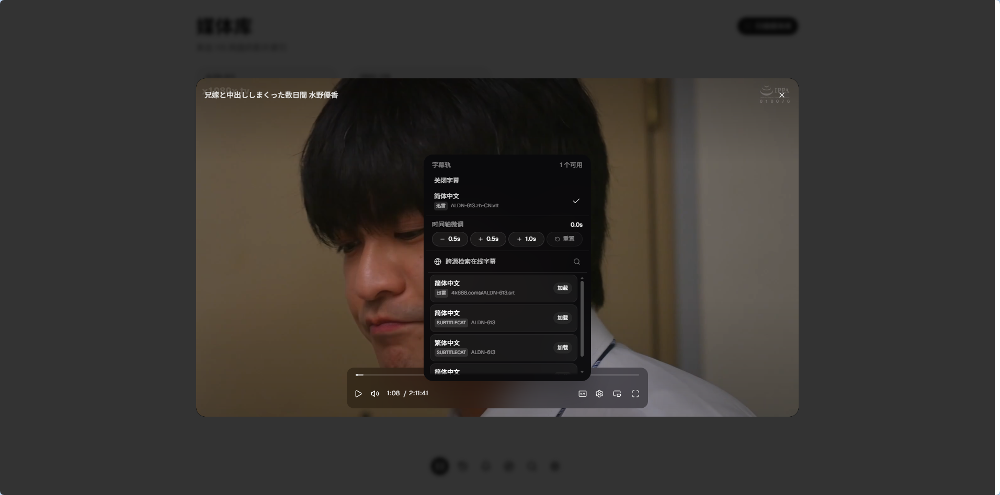

# Miyabi

配合 115 网盘的一站式 Jav & Emby 管理平台。

Miyabi 支持直接对接 115 进行刮削、订阅、播放，也可由 Miyabi 作为底层服务，对 Emby 提供支持。

## 项目预览





## Docker 部署

> \[!TIP]
> 您可以借助 AI 完成项目的部署。

公开镜像：

```text
ghcr.io/ppxb/miyabi
```

### 1. 使用 Docker CLI 运行

请将 `/path/to/data` 替换为主机上的数据持久化目录，并将 `change-this-password` 替换为自定义密码：

```bash
docker run -d \
  --name miyabi \
  --restart unless-stopped \
  --security-opt no-new-privileges:true \
  -p 8080:8080 \
  -v /path/to/data:/app/data \
  -e MIYABI_ACCESS_PASSWORD='change-this-password' \
  -e MIYABI_PUBLIC_URL='http://<宿主机IP>:8080' \
  ghcr.io/ppxb/miyabi:latest
```

> [!NOTE]
> 如果配合 Emby 使用，生成的 STRM 播放直链与元数据默认输出在 `/app/data/emby`（对应宿主机目录 `/path/to/data/emby`）。您可将该目录挂载至 Emby 容器作为媒体库。

### 2. 使用 Docker Compose（推荐）

创建 `docker-compose.yml` 文件：

```yaml
services:
  miyabi:
    image: ghcr.io/ppxb/miyabi:latest
    container_name: miyabi
    restart: unless-stopped
    security_opt:
      - no-new-privileges:true
    ports:
      - "8080:8080"
    volumes:
      - /path/to/data:/app/data
    environment:
      - MIYABI_ACCESS_PASSWORD=change-this-password
      - MIYABI_PUBLIC_URL=http://<宿主机IP>:8080
      # 可选：直接通过环境变量预设 Emby 集成（也可启动后在 Web 设置页中配置）
      # - MIYABI_EMBY_ENABLED=true
      # - MIYABI_EMBY_SERVER_URL=http://<Emby_IP>:8096
      # - MIYABI_EMBY_API_KEY=your-emby-api-key
      # - MIYABI_EMBY_MEDIA_PATH=/media
```

执行启动：

```bash
docker compose up -d
```

---

启动后访问 `http://<服务器IP>:8080`。

查看日志：

```bash
docker logs -f miyabi
```

### 升级镜像

升级时先拉取新镜像，再重新创建容器：

```bash
docker pull ghcr.io/ppxb/miyabi:latest
docker stop miyabi
docker rm miyabi
```

然后重新执行 `docker run` 命令（或在 Compose 目录下执行 `docker compose up -d`），沿用原访问密码和数据目录。

## 启动配置

启动配置统一使用环境变量，未设置时采用默认值。监听地址与数据目录显式设为空时会报错。

通过 `MIYABI_ACCESS_PASSWORD` 配置访问密码。未配置密码或将密码设为空时关闭门禁。**强烈建议您开启门禁**。

| 环境变量                 | 用途                                                  | 默认值                                        |
| ------------------------ | ----------------------------------------------------- | --------------------------------------------- |
| `MIYABI_ACCESS_PASSWORD` | Web 入口访问密码                                      | 空，关闭门禁（强烈建议配置）                  |
| `MIYABI_PUBLIC_URL`      | 外部访问 Miyabi 的根地址，用于生成 STRM 播放直链      | 默认根据监听端口推导                          |
| `MIYABI_LISTEN`          | HTTP 监听地址                                         | `:8080`                                       |
| `MIYABI_DATA_DIR`        | SQLite 与图片缓存目录                                 | 容器内为 `/app/data`，二进制为 `./data`       |
| `MIYABI_EMBY_DIR`        | STRM 与媒体导出目录                                   | `$MIYABI_DATA_DIR/emby`                       |
| `MIYABI_EMBY_ENABLED`    | 是否启用 Emby 集成通知刷新                            | 配置了服务器或密钥时自动为 `true`             |
| `MIYABI_EMBY_SERVER_URL` | Emby 服务器访问地址（如 `http://192.168.1.100:8096`） | 空，可在 Web 界面动态配置                     |
| `MIYABI_EMBY_API_KEY`    | Emby API 密钥（在 Emby「高级」→「API 密钥」中生成）   | 空，可在 Web 界面动态配置                     |
| `MIYABI_EMBY_MEDIA_PATH` | Emby 容器内挂载的媒体库路径（如 `/media`）            | 空（默认使用本地路径），可在 Web 界面动态配置 |
| `MIYABI_STRM_TOKEN`      | STRM 播放直链访问鉴权 Token                           | 空，未启用 Token 鉴权                         |

> [!TIP]
> Emby 相关配置（服务器地址、API Key、媒体库路径等）除通过环境变量在容器初始化时配置外，也可以在服务启动后随时通过 Web 界面「设置」→「Emby」中进行可视化配置与连通性测试。

## NSFW 警告

本软件可能存在裸露、暴力、色情或冒犯等不适宜公众场合的内容，请勿在公共场合使用本软件，避免不必要的纷争。

## 特别鸣谢

感谢 [莫愁](https://github.com/zk020106) 的 token，感谢 [老罗](https://github.com/luoqiz) 的115账号。

## 致谢

本项目参考了以下项目的部分实现，在此表示衷心的感谢！

- [javdb-cli](https://github.com/FlanChanXwO/javdb-cli)

同时感谢社区 [LinuxDO](https://linux.do) 的帮助。

## 免责声明

本项目仅供学习、研究和技术交流使用。项目作者与任何第三方服务、原始应用或内容提供方无关。
使用者应自行遵守当地法律法规以及相关服务条款。因使用本项目产生的任何法律、版权、账号、数据或财务风险均由使用者自行承担。

## License

遵循 [GNU GPL v3](./LICENSE) 协议。
